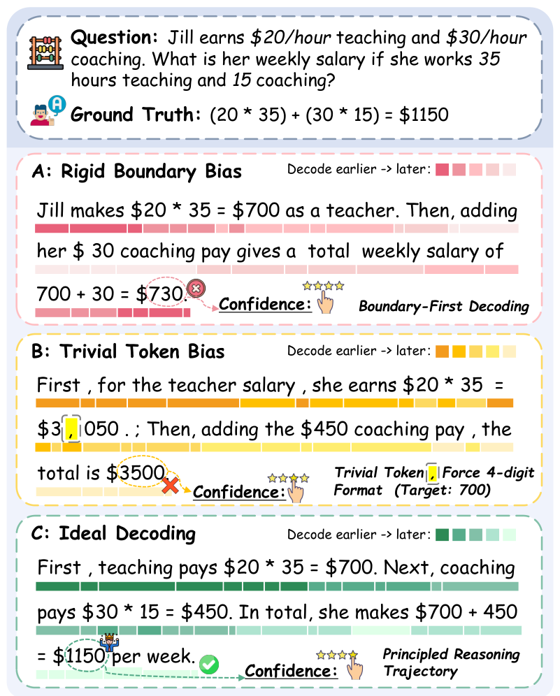

<div align="center">

# UNCODE: Empirical Analysis of Decoding Biases in Masked Diffusion Models

<p>
  <a href="https://github.com/NEUIR/Uncode">
    
  </a>
  <a href="https://arxiv.org/abs/2508.13021">
    
  </a>
  <a href="https://passionate11.github.io/Uncode-project-page/">
    
  </a>
  <a href="https://huggingface.co/papers/2508.13021">
    
  </a>
  <a href="https://aclanthology.org/2026.acl-long.311/">
    
  </a>
  <a href="LICENSE">
    
  </a>
</p>

<p>
  <b>A training-free decoding-calibration framework that fixes two systematic biases<br/>
  in Masked Diffusion Models — improving reasoning &amp; planning by 7%+ across 3 MDMs and 7 benchmarks.</b>
</p>


</div>

<p align="center">
  <a href="#introduction">📖 Introduction</a> •
  <a href="#news">🎉 News</a> •
  <a href="#setup">⚙️ Setup</a> •
  <a href="#evaluation">📃 Evaluation</a> •
  <a href="#trajectory">📈 Trajectory</a> •
  <a href="#algorithm">💻 Algorithm</a> •
  <a href="#citation">📌 Citation</a> •
  <a href="#contact">📧 Contact</a>
</p>

---

<a id="introduction"></a>
## 📖 Introduction

**UNCODE** (**UN**masking **C**alibration for Dec**O**ding **DE**biasing) is a novel, *training-free* decoding strategy for Masked Diffusion Models (MDMs) that unifies **global trajectory planning** with **content-aware informativeness maximization**.

Uncertainty-based samplers, when applied to MDMs, suffer from two systematic decoding biases:

- **🔴 Rigid Boundary Bias** — boundary tokens (BOS/EOS, sentence edges) are decoded first, collapsing decoding into a fixed *U-shaped* trajectory and committing to an answer before the reasoning is built.
- **🟡 Trivial Token Bias** — high-frequency, low-information tokens (punctuation, spaces, fillers) get over-prioritized, spending the decoding budget on surface structure instead of reasoning content.

UNCODE fixes both with a **position-aware weighting mechanism** and a **calibrated, frequency-aware confidence score**, guiding the decoding path and suppressing premature selection of unimportant tokens — with **no fine-tuning and no architecture change**.

<div align="center">
  <a href="https://passionate11.github.io/Uncode-project-page/">
    
  </a>
</div>

> 📄 Paper: [arXiv:2508.13021](https://arxiv.org/abs/2508.13021) · 🌐 Project page: **[passionate11.github.io/Uncode-project-page](https://passionate11.github.io/Uncode-project-page/)**

<a id="news"></a>
## 🎉 News

- **2026-04-07**: Our paper has been **accepted to ACL 2026 (Main Conference)**! 🎉
- **2025-09-12**: Release adds enhanced LLaDA decoding support, integrating recent semi- and non-autoregressive sampling strategies: [ReMDM](https://arxiv.org/pdf/2503.00307), [Fast-dLLM](https://arxiv.org/pdf/2505.22618v1), [Semi-AR](https://arxiv.org/abs/2502.09992), Margin-, Entropy- and Confidence-based samplers.
- **2025-08-19**: Released our [paper on arXiv](https://arxiv.org/abs/2508.13021) and [code on GitHub](https://github.com/NEUIR/Uncode).

## ✨ Highlights

| | |
|---|---|
| 🚀 **>7%** average gain over the strongest decoding baseline | 🧩 **3 × 7** MDM backbones × reasoning &amp; planning benchmarks |
| ⚖️ **44.7 ≈ 45.3** — LLaDA-1.5 + UNCODE rivals autoregressive Qwen-2.5-7B | 🔌 **0** extra training — plug-and-play, decoding-side only |

<a id="setup"></a>
## ⚙️ Setup

```bash
git clone https://github.com/NEUIR/Uncode.git
cd Uncode
conda create --name uncode python==3.10
conda activate uncode
pip install -r requirements.txt
```

<a id="evaluation"></a>
## 📃 Evaluation

UNCODE and all baseline methods can be evaluated across mathematical reasoning, code generation, and question-answering datasets: **HumanEval**, **MBPP**, **GSM8K**, **MATH-500**, **GPQA**, **Countdown**, and **Sudoku**. Results are saved to the `results/` folder.

### Example — HumanEval with UNCODE

Change `--task` and `--mode` to evaluate on other datasets / decoding methods.

```bash
cd scripts
python eval.py \
    --task 'humaneval' \
    --model_name 'GSAI-ML/LLaDA-8B-Instruct' \
    --device 'cuda:0' \
    --gen_length 256 \
    --steps 256 \
    --block_length 256 \
    --mode pc_sampler \
    --lambd 0.25 \
    --alpha 10 \
    --data_path ../data/humaneval.jsonl \
    --result_path results/humaneval_pc_sampler
```

### Baseline decoding methods

| Decoding Method | Command | Decoding Method | Command |
|---|---|---|---|
| Semi-Autoregressive | `bash eval_semi_ar.sh` | Entropy | `bash eval_entropy.sh` |
| EB-Sampler | `bash eval_eb_sampler.sh` | Fast-dLLM | `bash eval_fast_dllm.sh` |
| Margin | `bash eval_margin.sh` | PC-Sampler | `bash eval_pc_sampler.sh` |
| ReMDM | `bash eval_remdm.sh` | Linear-Position | `bash eval_linear_position.sh` |

> All scripts live in `scripts/`. Run them from inside that folder (`cd scripts`).

### Evaluation tools & consistency

- **GSM8K** and **GPQA** are evaluated with [`lm-eval`](https://github.com/EleutherAI/lm-evaluation-harness); the remaining datasets use `scripts/eval.py`.
- All methods share the **same evaluation scripts** to ensure consistent, comparable assessment.

### Painting heatmaps

Generate decoding-trajectory heatmaps for different methods:

```bash
cd scripts
bash heatmap.sh
```

Heatmap outputs are saved to the `heatmap_results/` folder.

<a id="trajectory"></a>
## 📈 Decoding Trajectory

The decoding strategy strongly shapes the **generation order** of MDMs. Existing uncertainty-based methods exhibit a **U-shaped** trajectory (the *rigid boundary bias*): boundary tokens (BOS/EOS) are unmasked early because the attention mechanism's local positional bias inflates their confidence, after which decoding converges inward.

UNCODE instead introduces **explicit trajectory control** via position-aware weighting, yielding an adaptive generation order tailored to each task. Trajectories on GSM8K for four representative samplers:

<div align="center">

| Confidence-based | Entropy-based | Margin-based | **UNCODE** |
|:---:|:---:|:---:|:---:|
|  |  |  |  |

</div>

### 🔑 Key Observations

- **Rigid Boundary Bias** — confidence/entropy/margin samplers consistently show the U-shaped pattern, decoding both sequence boundaries first. This limits their ability to capture the global dependencies needed for complex reasoning.
- **Trivial Token Bias** — uncertainty-based samplers over-prioritize semantically trivial, high-frequency tokens (newlines, spaces, `the`, `.`, `!`), leading to suboptimal reasoning paths.
- **Debiasing with UNCODE** — exponential positional weighting removes the U-shape, producing a natural progression aligned with the logical flow of reasoning.

This adaptive trajectory control directly drives UNCODE's strong **82.2% GSM8K accuracy**, well above uncertainty-based alternatives.

<a id="algorithm"></a>
## 💻 Algorithm

UNCODE addresses the limitations of uncertainty-based sampling through two core components:

1. **Position-Aware Weighting** — an exponential decay over position regulates the decoding path, giving flexible control over generation order to match task structure.
2. **Calibrated Confidence Score** — a frequency-based adjustment from a reference corpus suppresses premature selection of trivial tokens, promoting semantically rich content.

Across seven benchmarks, UNCODE consistently outperforms existing MDM decoding strategies, narrowing the gap to state-of-the-art autoregressive models.

### Workflow

**Require**: Predictor $p_\theta$, prompt $p_0$, answer length $L$, steps $T$, hyperparameters $\lambda, \alpha$; reference corpus $\mathcal{D}'$

1. $p_{\mathcal{D}'} \gets \text{FreqDist}(\mathcal{D}')$
2. $x \gets \text{Concat}(p_0, \text{[MASK]} \times L)$
3. **for** $t = 1$ to $T$ **do**
   - $\mathcal{M}_t \gets \{i \mid x^i = \text{[MASK]}\}$ &nbsp;`// mask indices`
   - **if** $\mathcal{M}_t = \emptyset$ **then break**
   - $\hat{x}_0, \hat{p}^i \gets p_{\theta}(\cdot \mid x)$
   - **for** each position $i \in \mathcal{M}_t$ **do**
     - $\mathcal{C}^{(i)} \gets \hat{p}^i \cdot \log p_{\mathcal{D}'}(x^i)$
     - $\mathcal{C}^{(i)} \gets \min(\mathcal{C}^{(i)}, \alpha)$ &nbsp;`// clip salience`
     - $w^{(i)} \gets e^{-\lambda \cdot (i - |p_0|)}$
     - $\text{score}^{(i)} \gets w^{(i)} \cdot \mathcal{C}^{(i)}$
   - $n_k \gets \text{NumToReveal}(k, N, |\mathcal{M}_k|)$
   - $\mathcal{S}_t \gets \text{TopK}(\text{score}, n_k)$ &nbsp;`// select best tokens`
   - **for** each index $j \in \mathcal{S}_t$ **do** $x^j \gets \hat{x}_0^j$ &nbsp;`// reveal`
4. **return** $x$

### Hyperparameters

| Param | Meaning | Recommended |
|---|---|---|
| $\lambda$ (`--lambd`) | Positional bias strength: `0` = no bias, larger = stronger left-to-right | `0` (Sudoku), `0.25` (most tasks), `0.5` (Countdown) |
| $\alpha$ (`--alpha`) | Clipping threshold for the salience score | `10` (stable across tasks) |
| $p_{\mathcal{D}'}$ | Background frequency distribution from a reference corpus | see [`data/baseline`](data/baseline) |

<a id="citation"></a>
## 📌 Citation

If you find UNCODE useful, please cite:

```bibtex
@inproceedings{huang-etal-2026-empirical,
    title     = "Empirical Analysis of Decoding Biases in Masked Diffusion Models",
    author    = "Huang, Pengcheng and Liu, Tianming and Liu, Zhenghao and Yan, Yukun and Wang, Shuo and Xiao, Tong and Chen, Zulong and Sun, Maosong",
    booktitle = "Proceedings of the 64th Annual Meeting of the Association for Computational Linguistics (Volume 1: Long Papers)",
    year      = "2026",
    publisher = "Association for Computational Linguistics",
    url       = "https://aclanthology.org/2026.acl-long.311/",
    pages     = "6853--6876",
}
```

<a id="contact"></a>
## 📧 Contact

Questions, suggestions, or bug reports are welcome — please open an issue or email **pengcheng.neu@outlook.com**.
